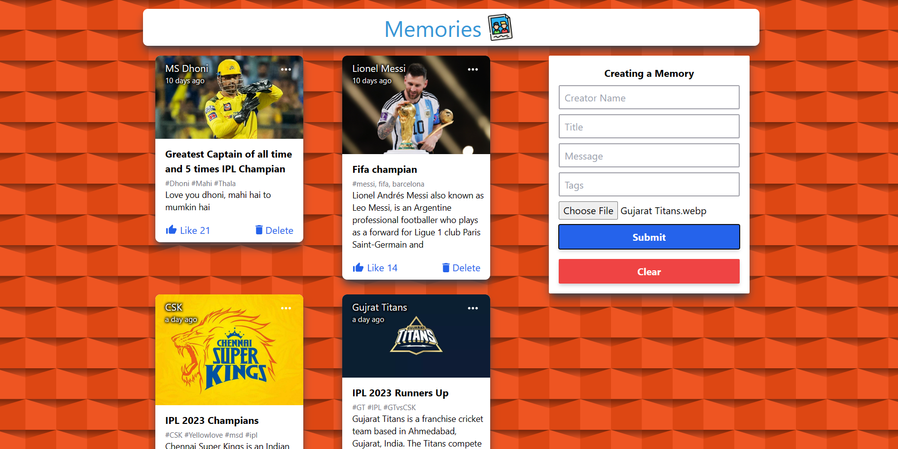
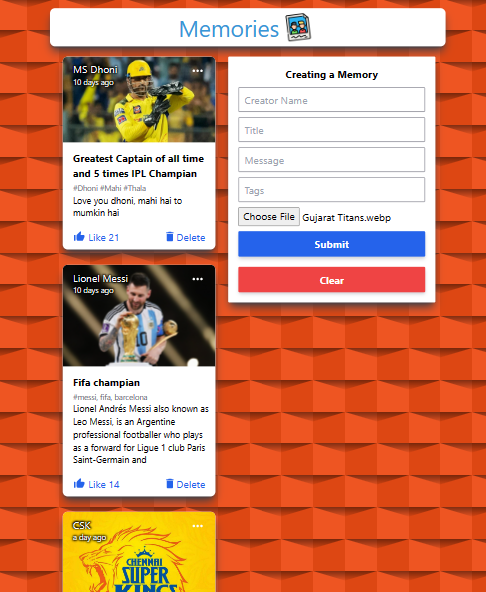
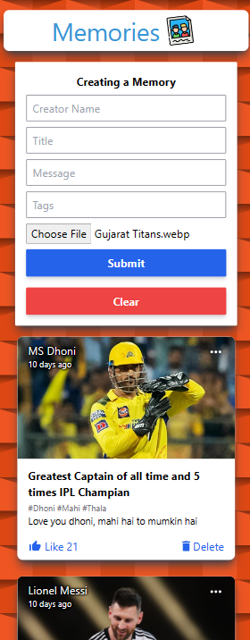

# Memories Social-Media MERN App (BackEnd).

The App is called "Memories" and it is a simple social media app that allows users to post interesting events that happened in their lives.

## Table of contents

-   [Overview](#overview)
    -   [The Theme](#the-theme)
    -   [Screenshot](#screenshot)
    -   [Links](#links)
-   [My process](#my-process)
    -   [Built with](#built-with)
    -   [What I learned](#what-i-learned)
    -   [Useful resources](#useful-resources)
-   [Author](#author)

## Overview

### The Theme

Users should be able to:

-   View the posts that are posted and it is stored on the backend.
-   Create, Update, Delete and Read the Posts.
-   Like the posts and able to edit the post.

### Screenshot

| Desktop View                                   |
| ---------------------------------------------- |
|  |

| Tablet View                                   | Mobile View                                  |
| --------------------------------------------- | -------------------------------------------- |
|  |  |

### Links

-   [Github Solution](https://github.com/ShivamManiMaurya/memories-project-backend)
-   [Live Site](https://memories-proj-app-mern.netlify.app/)

## My process

### Built with

-   HTML5
-   CSS custom properties
-   Flexbox
-   [TailwindCSS](https://tailwindcss.com/) - For styling
-   JavaScript
-   [React](https://reactjs.org/) - JS library
-   [MongoDB](https://cloud.mongodb.com/) - For database
-   NodeJs - For backend
-   ExpressJs - For backend

### What I learned

-   Get familiar with MongoDB and mongoose
-   Get familiar with routes, Api
-   Get familiar with backend technologies like NodeJs and ExpressJs
-   Get more familiar with Redux
-   Get more familiar with Async/Await
-   Get more familiar with Try-Catch block
-   Get more familiar with tailwindCSS

### Useful resources

-   [JavaScript Mastery](https://www.youtube.com/@javascriptmastery) - A very special thanks to JavaScript Mastery.
-   [Akshay Saini](https://www.youtube.com/@akshaymarch7) - Akshay Saini bhaiya helped me in understanding different Javascript concepts.

## Author

-   Website - [Shivam Maurya](https://shivammanimaurya.github.io/my_portfolio_website/)
-   GitHub Page - [Shivam Maurya GitHub](https://github.com/ShivamManiMaurya)
-   Linkedin - [@shivammanimaurya](https://www.linkedin.com/in/shivammanimaurya)
